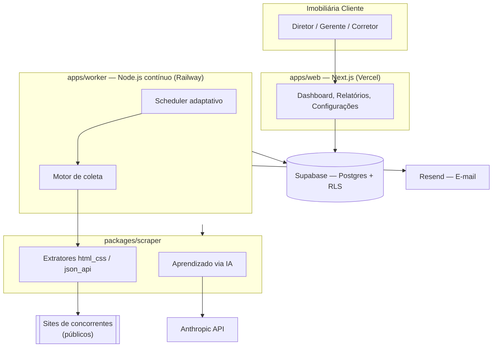

<div align="center">

# Q&A Imob

### Vigilância competitiva de preços para imobiliárias

Monitore automaticamente os concorrentes. Saiba na hora quando um preço muda.


</div>

---

## Sobre o projeto

Hoje, uma imobiliária só descobre que um concorrente mudou o preço de um
imóvel se alguém entrar manualmente no site dele e comparar de memória.

O **Q&A Imob** automatiza essa vigilância: o cliente cadastra a URL de
um concorrente, uma IA aprende sozinha a estrutura daquele site (que pode
ter qualquer formato — HTML estático, API JSON própria, WordPress, Angular,
o que for) e o sistema passa a checar automaticamente, alertando qualquer
mudança de preço, novo anúncio ou imóvel removido.

Produto da **Q&A Company**, empresa de produção audiovisual, marketing
digital e soluções digitais.

---

## Índice

- [Funcionalidades](#funcionalidades)
- [Arquitetura](#arquitetura)
- [Stack tecnológica](#stack-tecnológica)
- [Estrutura do monorepo](#estrutura-do-monorepo)
- [Papéis de usuário](#papéis-de-usuário)
- [Rodando localmente](#rodando-localmente)
- [Deploy](#deploy)
- [Segurança e privacidade](#segurança-e-privacidade)
- [Status do projeto](#status-do-projeto)

---

## Funcionalidades

- 🤖 **Cadastro guiado por IA** — a IA aprende a estrutura de qualquer
  site de concorrente, sem template fixo, com prévia de cobertura antes
  de ativar
- 🔄 **Checagem automática e recorrente** — worker contínuo, com
  intervalo que **se auto-ajusta** (sobe e desce) com base na duração
  real medida de cada checagem
- 🩹 **Self-healing** — quando um site muda de layout, o sistema tenta
  se readaptar sozinho, sem quebrar o histórico já acumulado
- 🔔 **Alertas** — notificação instantânea no sistema + resumo diário
  por e-mail
- 🏢 **Multi-tenant real** — várias imobiliárias-cliente na mesma
  infraestrutura, com isolamento total de dados via Row Level Security
- 👥 **Hierarquia de acesso** — SuperAdmin, Diretor, Gerente e Corretor,
  cada um com o nível certo de permissão
- 📊 **Dashboard, relatórios e histórico** — com gráficos, exportação em
  PDF e auditoria completa de ações
- 🛡️ **Coleta responsável** — respeito a `robots.txt`, User-Agent
  transparente, rate limiting e controle de frequência

---

## Arquitetura



---

## Stack tecnológica

| Camada | Tecnologia |
|---|---|
| Frontend / Dashboard | Next.js (App Router), TypeScript, Tailwind |
| Worker de coleta | Node.js, processo contínuo |
| Banco de dados | Supabase (Postgres + RLS + Auth) |
| IA | Anthropic API (Claude) |
| E-mail | Resend |
| Hospedagem — Web | Vercel |
| Hospedagem — Worker | Railway |

---

## Estrutura do monorepo

```
qea-imob/
├── apps/
│   ├── web/              # Dashboard Next.js
│   └── worker/            # Worker de checagem contínua
├── packages/
│   └── scraper/           # Motor de coleta e IA, compartilhado
├── supabase/
│   └── migrations/        # Histórico completo de schema
└── scripts/                # Utilitários administrativos
```

---

## Papéis de usuário

| Papel | Acesso |
|---|---|
| **SuperAdmin** | Gerencia todas as contas-cliente, aprova recalibrações sensíveis, monitora saúde do sistema |
| **Diretor / T.I** | Gestão completa da própria conta: concorrentes, usuários, configurações |
| **Gerente** | Mesma gestão do Diretor, exceto sobre outros Diretores/Gerentes |
| **Corretor** | Acesso somente leitura: painel, histórico, relatórios |

---

## Rodando localmente

```bash
# instalar dependências
npm install

# copiar os templates de ambiente e preencher com credenciais reais
cp apps/web/.env.local.example apps/web/.env.local
cp apps/worker/.env.local.example apps/worker/.env.local

# subir o dashboard
npm run dev --workspace=apps/web

# em outro terminal, subir o worker
npm run dev --workspace=apps/worker
```

> As migrations em `supabase/migrations/` precisam ser aplicadas, em
> ordem, no projeto Supabase que você for usar (via SQL Editor).

---

## Deploy

- **apps/web** → Vercel (Root Directory: `apps/web`)
- **apps/worker** → Railway (Root Directory: `apps/worker`, processo
  contínuo, não serverless)
- Domínio: subdomínio próprio (`imob.qeacompany.com.br`)

Deploy automático a cada push na branch principal, em ambas as
plataformas.

---

## Segurança e privacidade

- Isolamento de dado entre contas-cliente garantido por **Row Level
  Security** no Postgres — validado com múltiplas contas reais
  simultâneas, não só por leitura de código
- Coleta de dado de terceiros feita de forma transparente (User-Agent
  identificável) e respeitando `robots.txt`
- Termos de Uso e Política de Privacidade com fluxo de aceite obrigatório
- Auditoria completa de ações administrativas

---

## Status do projeto

🚧 Em produção com cliente piloto ativo. Novas funcionalidades e
refinamentos sendo adicionados continuamente.

---

<div align="center">

Feito por **Q&A Company**

</div>
